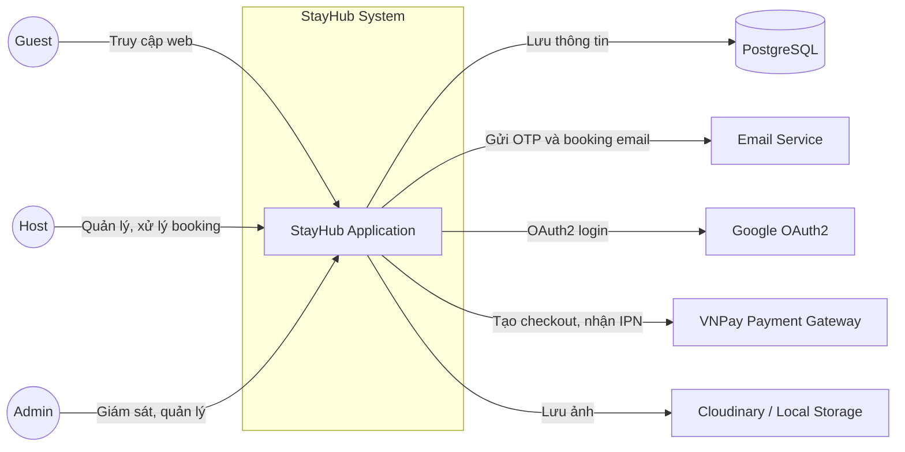
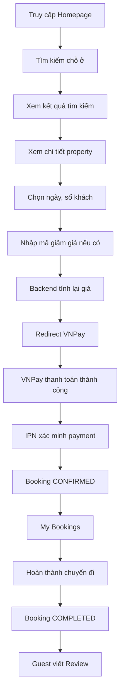
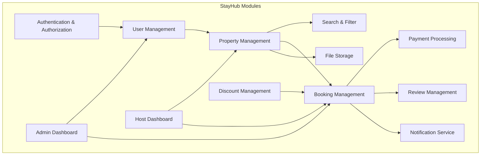

# System Overview: StayHub

## 1. Mục tiêu & Tầm nhìn

StayHub là một nền tảng trung gian (marketplace) hai chiều, kết nối:

- **Host** (chủ nhà cho thuê chỗ ở)
- **Guest** (khách du lịch, người đi công tác cần đặt phòng)

Nền tảng **không sở hữu** bất kỳ bất động sản nào. Vai trò của StayHub là:

1. Cho Host đăng tin chỗ ở của mình lên hệ thống.
2. Cho Guest tìm kiếm, so sánh và đặt chỗ ở phù hợp.
3. Đứng giữa xử lý thanh toán, xác nhận đặt phòng, và thu phí dịch vụ trên mỗi giao dịch thành công.

**Tầm nhìn:** Cung cấp một giải pháp đặt phòng trực tuyến đơn giản, tập trung vào trải nghiệm người dùng và cho phép Host quản lý chỗ ở của họ một cách dễ dàng.

## 2. Các bên liên quan (Stakeholders)

| Vai trò | Mô tả | Quyền hạn chính |
| :--- | :--- | :--- |
| **Guest** | Khách thuê, người dùng phổ thông nhất | - Tìm kiếm, lọc, xem chi tiết chỗ ở - Đặt phòng, thanh toán - Xem và quản lý các booking của mình - Viết đánh giá sau khi hoàn thành chuyến đi |
| **Host** | Chủ nhà, người cho thuê chỗ ở | - Đăng tin, quản lý chỗ ở - Xem và xử lý yêu cầu đặt phòng (Accept/Reject) - Theo dõi doanh thu, booking |
| **Admin** | Quản trị hệ thống | - Xem dashboard tổng quan (số users, hosts, bookings, revenue) - Quản lý booking toàn hệ thống - Quản lý tài khoản người dùng (khoá/mở khoá, đổi vai trò) |

## 3. Ngữ cảnh hệ thống (System Context)

- **PostgreSQL**: Cơ sở dữ liệu chính lưu trữ tất cả dữ liệu nghiệp vụ (users, properties, bookings, payments, reviews...).
- **Email Service**: Gửi OTP đăng ký và thông báo HTML cho Guest khi trạng thái booking thay đổi (hiện tại dùng SMTP/Gmail, sau có thể tích hợp các dịch vụ như SendGrid).
- **Google OAuth2**: Cho phép đăng nhập/đăng ký nhanh bằng tài khoản Google, tự provision user nội bộ với role `GUEST`.
- **VNPay Payment Gateway**: Xử lý thanh toán VND qua checkout/QR, redirect user về StayHub và gửi IPN để backend xác nhận thanh toán.
- **Storage Service**: Lưu trữ ảnh đại diện, ảnh property (dùng Cloudinary cho production, LocalStorage cho development).

## 4. Các ràng buộc & yêu cầu chất lượng (Quality Goals)

### 4.1. Phi chức năng (Non-functional Requirements)

| Yêu cầu | Mức độ | Mô tả |
| :--- | :--- | :--- |
| **Hiệu năng** | Trung bình | Trang chủ, tìm kiếm cần tải trong < 2 giây cho 100 người dùng đồng thời. |
| **Bảo mật** | Cao | Mật khẩu được mã hóa BCrypt. Session-based authentication. Phân quyền rõ ràng (GUEST, HOST, ADMIN). |
| **Khả dụng** | Cao (MVP) | Ứng dụng được đóng gói Docker, dễ dàng khôi phục. |
| **Khả năng mở rộng** | Trung bình | Thiết kế module theo tính năng (feature-based) để dễ dàng thêm tính năng mới sau. |
| **Dễ bảo trì** | Cao | Code tuân thủ quy chuẩn (rules.md), sử dụng DTO tách biệt Entity. |

### 4.2. Ràng buộc kỹ thuật

- Sử dụng **Java 21** và **Spring Boot 3.3.2**.
- Cơ sở dữ liệu **PostgreSQL 16**.
- Frontend sử dụng **Thymeleaf** + **Tailwind CSS** + **Alpine.js/htmx**.
- Quản lý schema bằng **Flyway**.
- Đóng gói và triển khai bằng **Docker**.
- Ứng dụng là **Monolith**, không dùng microservices ở giai đoạn MVP.

## 5. Tổng quan luồng nghiệp vụ (Business Flow)

Luồng chính của Guest từ lúc truy cập đến khi hoàn thành đánh giá:

Chi tiết từng bước đã được mô tả trong `flow.md`.

## 6. Các module chính (High-level Modules)

- **Auth**: Xác thực, phân quyền, đăng ký bằng OTP email, đăng nhập Google OAuth2.
- **User**: Quản lý thông tin người dùng.
- **Property**: CRUD cho chỗ ở, ảnh, tiện nghi.
- **Search**: Tìm kiếm, lọc, sắp xếp, phân trang.
- **Booking**: Quản lý đặt phòng, trạng thái, kiểm tra trùng lịch.
- **Payment**: Xử lý thanh toán Mock/VNPay, verify IPN, polling trạng thái sau redirect.
- **Discount**: Validate promo code, tính discount snapshot, chỉ tăng usage sau payment success.
- **Review**: Đánh giá của Guest.
- **Host**: Dashboard cho Host.
- **Admin**: Dashboard cho Admin.
- **Notification**: Gửi email OTP và email booking status dạng HTML có plain-text fallback.
- **Storage**: Lưu trữ ảnh.

## 7. Công nghệ sử dụng

Xem chi tiết [TechStack](2_TechStack.md)

## 8. Tài liệu liên quan

- [Luồng nghiệp vụ chi tiết](../architecture/0_DemoSystem.md)
- [Quy chuẩn làm việc](../contributors/Rules.md)
- [Thiết kế cơ sở dữ liệu](../database/1_DomainOverview.md)
- [Thiết kế API](3_API_Design.md)
- [Hướng dẫn bắt đầu](../contributors/FirstStep.md)
