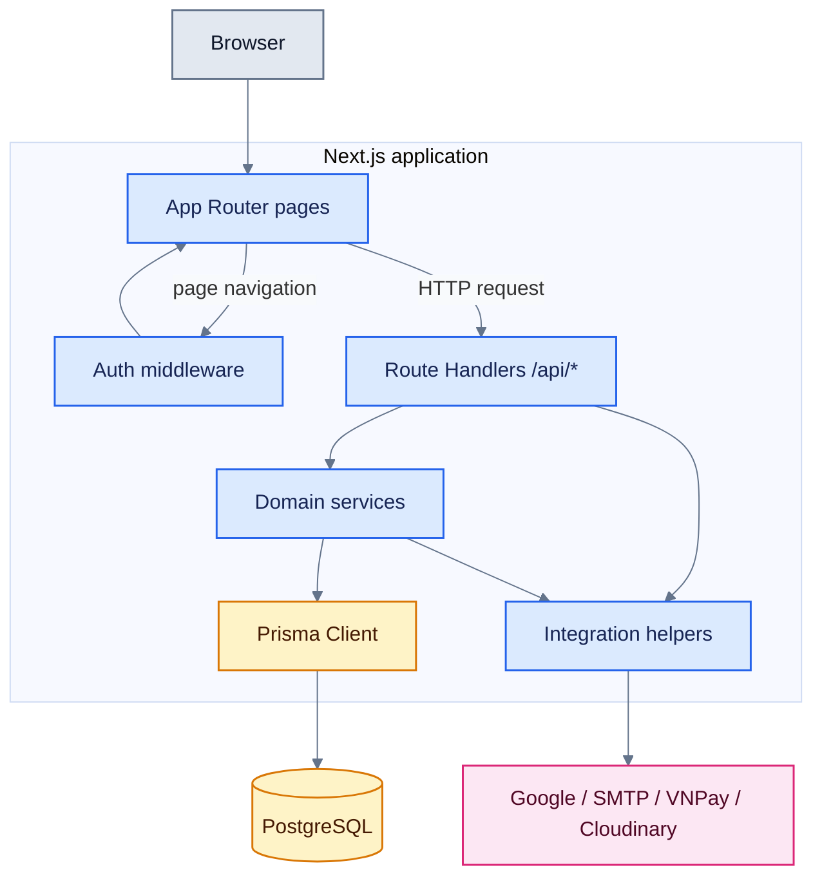
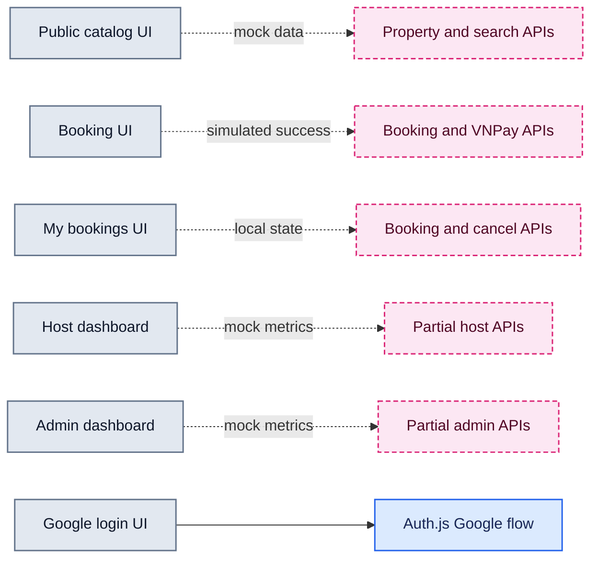

# Runtime Architecture

**Câu hỏi:** Một request đi qua những boundary và thành phần runtime nào?

**Trạng thái:** Hiện trạng. StayHub là một Next.js application duy nhất, không
phải frontend và backend triển khai độc lập.

Middleware chỉ bảo vệ page routes được khai báo trong `middleware.ts`; từng API
route tự kiểm tra session, role và ownership. TanStack Query đã được cấu hình ở
provider nhưng các feature page hiện chưa dùng.

**Evidence:** `src/app/layout.tsx`, `src/app/providers.tsx`, `middleware.ts`,
`src/app/api`, `src/services`, `src/lib/prisma.ts`.

## Current UI Integration

**Câu hỏi:** Những capability backend nào đã được nối tới UI hiện tại?

Nét đứt biểu thị capability tồn tại ở server nhưng chưa được UI sử dụng
end-to-end. Đây là mô tả hiện trạng, không phải dependency mục tiêu.
