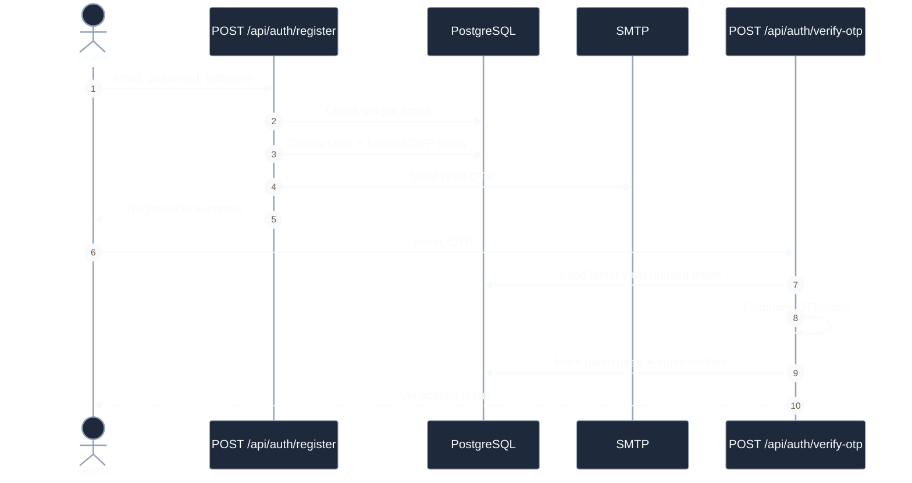
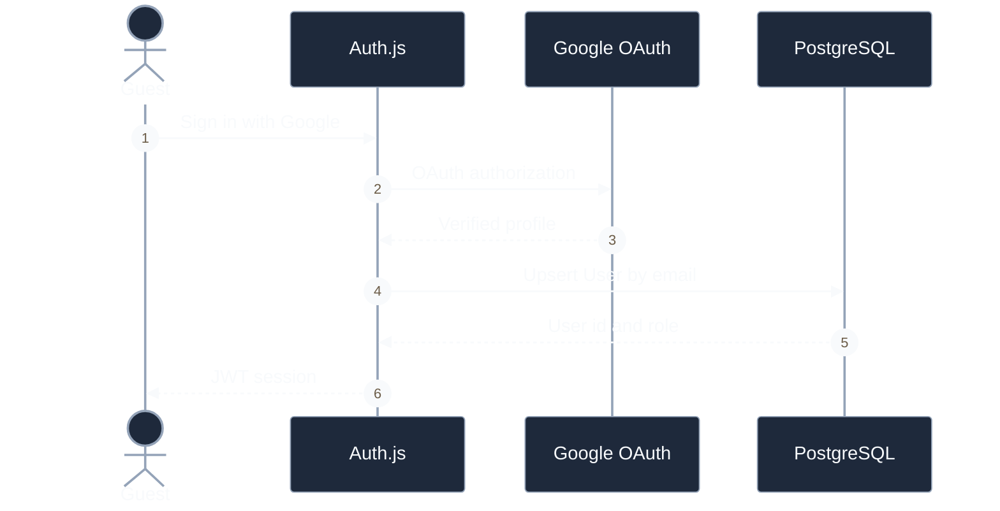

# Authentication Sequences

## Local Registration And OTP

**Câu hỏi:** Backend tạo và xác minh tài khoản local như thế nào?

**Trạng thái:** API đã triển khai; form đăng ký và OTP trên UI chưa triển khai.

## Google Login

**Câu hỏi:** Google identity được ánh xạ vào StayHub session như thế nào?

**Known gap:** Google callback hiện không từ chối user có status `LOCKED`.
