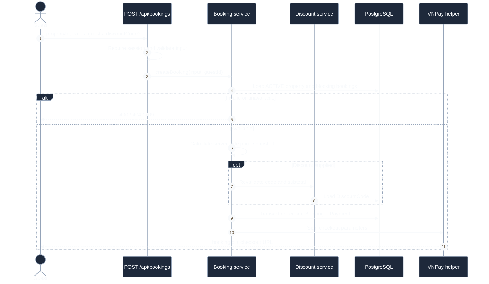
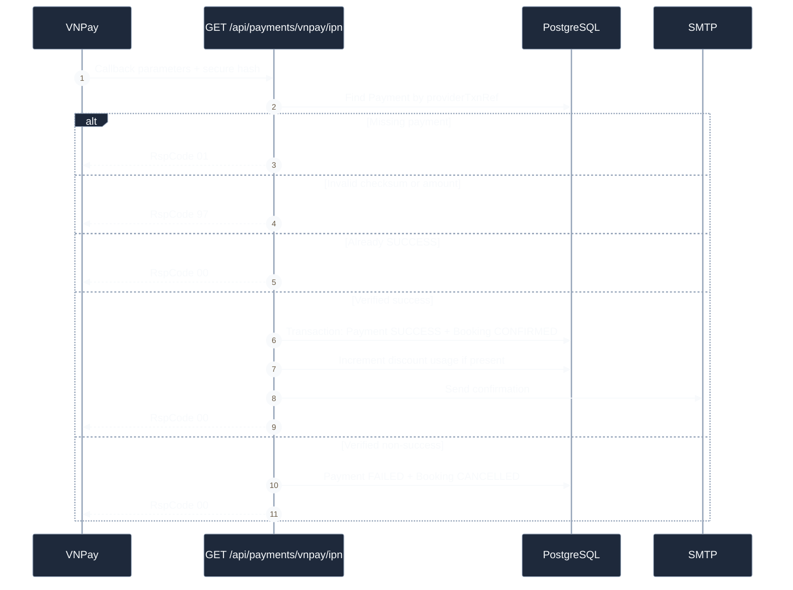
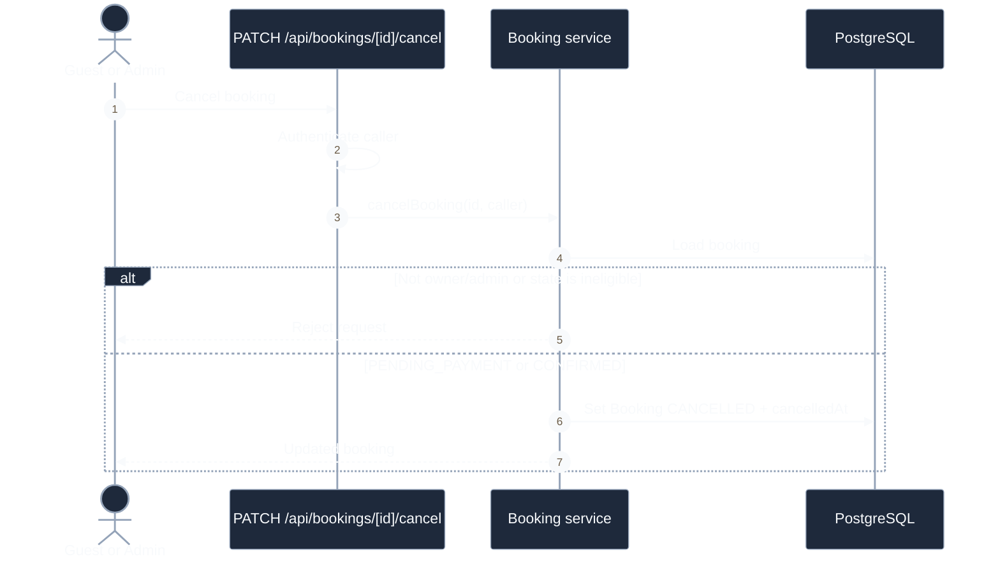

# Booking And Payment Sequences

## Create Booking And Checkout

**Câu hỏi:** Backend tạo price snapshot và VNPay checkout như thế nào?

**Trạng thái:** Backend đã triển khai; booking page hiện chưa gọi flow này.

Availability check nằm trước transaction và database chưa có exclusion
constraint, vì vậy concurrent requests vẫn có nguy cơ double booking.

## VNPay IPN

**Câu hỏi:** Callback nào quyết định kết quả payment và booking?

IPN là source of truth. Return page hiện tin query string và luôn hiển thị thành
công; status endpoint đã tồn tại nhưng chưa được page gọi.

## Cancel Booking

**Câu hỏi:** Cancellation hiện thay đổi dữ liệu nào?

Hiện tại flow không cập nhật Payment, không refund qua VNPay và không gửi email.
