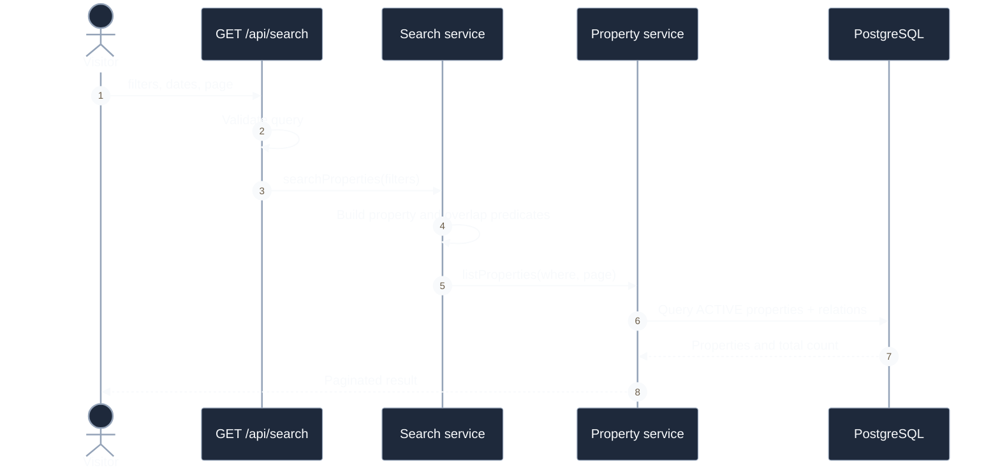

# Discovery Sequences

## Search API

**Câu hỏi:** Backend tìm property khả dụng như thế nào?

**Trạng thái:** API đã triển khai; search page hiện lọc mock data và chưa gọi API.

`sort` được schema chấp nhận nhưng service chưa áp dụng; amenity filter hiện có
nghĩa “có ít nhất một amenity được chọn”.
