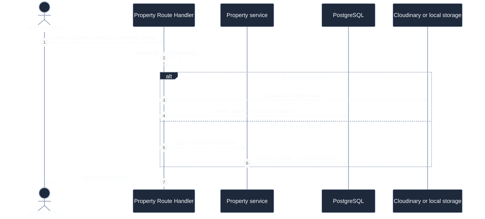
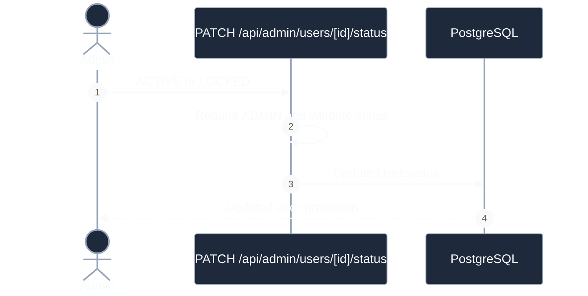

# Operations Sequences

## Manage Property

**Câu hỏi:** Host hoặc Admin thay đổi listing như thế nào?

Property được tạo ở `DRAFT`; chưa có workflow chuyển sang `ACTIVE`. Delete endpoint
thực hiện archive sang `INACTIVE`, không xóa vật lý.

## Change User Status

**Câu hỏi:** Admin khóa hoặc mở khóa user như thế nào?

JWT đã phát hành không bị thu hồi ngay; role/status trong token có thể stale.
