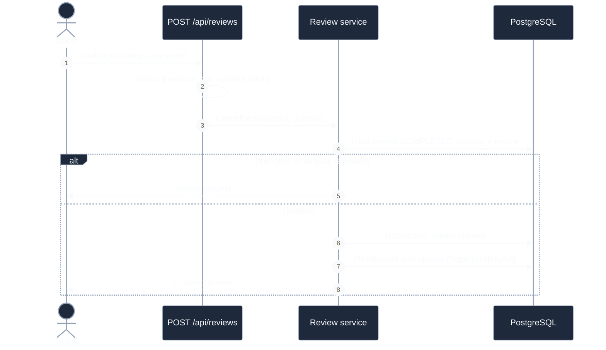

# Review Sequence

## Create Review

**Câu hỏi:** Hệ thống bảo đảm review hợp lệ và cập nhật rating nguyên tử thế nào?

**Trạng thái:** API đã triển khai; UI và transition booking sang `COMPLETED` chưa
triển khai.

