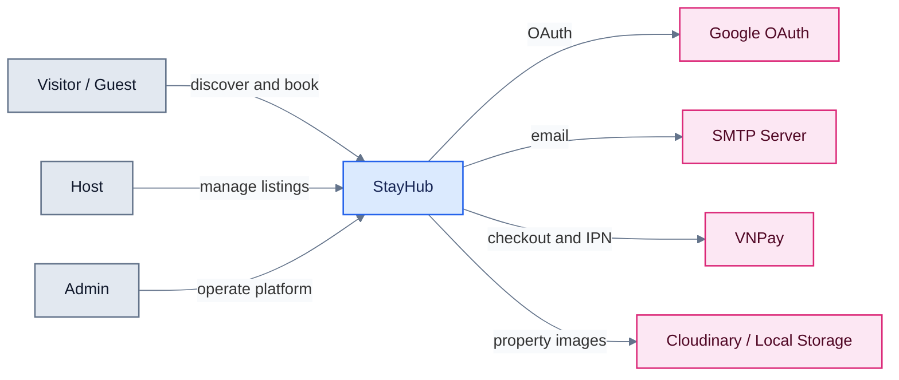

# System Context

**Câu hỏi:** StayHub phục vụ actor nào và phụ thuộc vào hệ thống bên ngoài nào?

**Trạng thái:** Hiện trạng, đối chiếu với `src/lib`, `src/app/api` và
`prisma/schema.prisma`.

PostgreSQL nằm trong runtime boundary của StayHub và được thể hiện ở
[Runtime architecture](runtime-architecture.md), không phải external actor của
context view này.

**Evidence:** `src/lib/auth.ts`, `src/lib/email.ts`, `src/lib/vnpay.ts`,
`src/lib/cloudinary.ts`.
