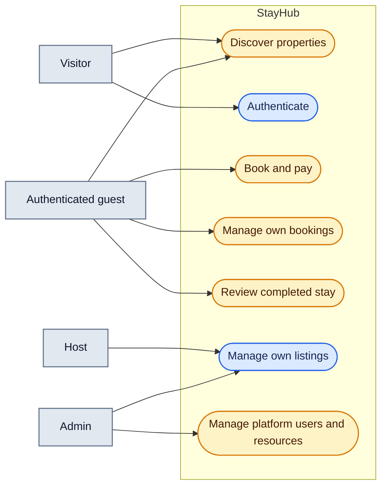

# Use Cases

**Câu hỏi:** Actor nào theo đuổi mục tiêu nào trong phạm vi MVP hiện tại?

Màu vàng biểu thị capability có backend nhưng UI hoặc lifecycle chưa hoàn chỉnh.
Host approval cho từng booking không thuộc MVP: VNPay IPN xác nhận booking trực
tiếp. Review chưa đạt được qua luồng bình thường vì chưa có transition tự động
sang `COMPLETED`.
