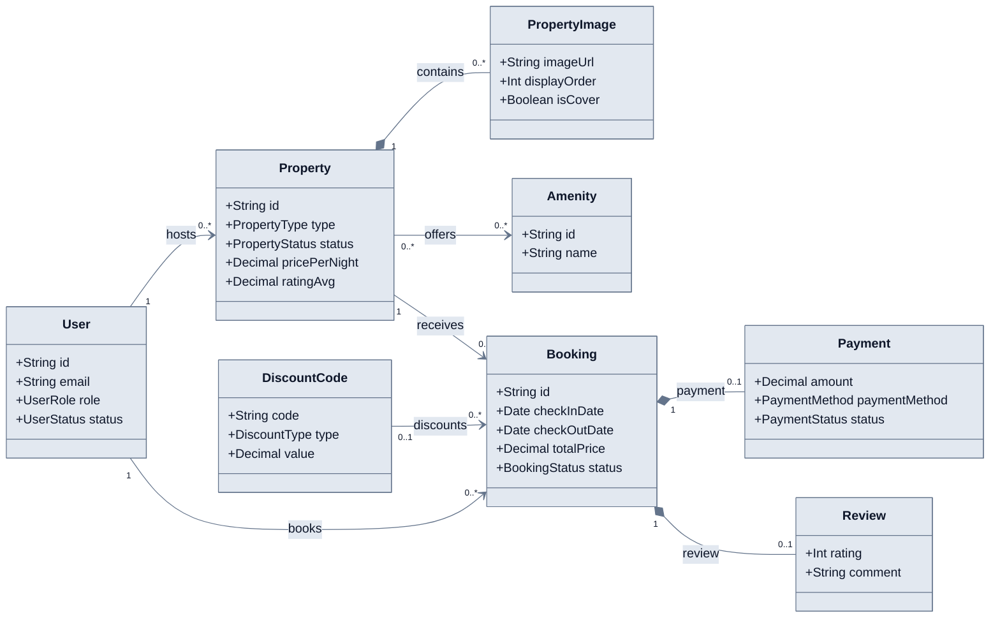

# Logical Domain Model

**Câu hỏi:** Những concept cốt lõi nào tạo thành domain StayHub và chúng sở hữu
nhau như thế nào?

Diagram này chỉ thể hiện identity, composition và dependency quan trọng; field
vật lý nằm trong [Relational model](relational-model.md).

Booking giữ financial snapshot tại thời điểm tạo. Payment và Review là optional
theo schema, dù booking service hiện tạo Payment trong cùng transaction.

**Evidence:** `prisma/schema.prisma`, `src/services/booking.service.ts`,
`src/services/review.service.ts`.
