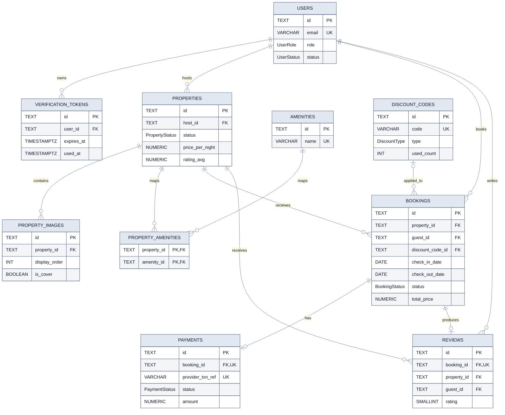

# Physical Relational Model

**Câu hỏi:** Các bảng hiện tại liên kết với nhau bằng key và cardinality nào?

Các field được giới hạn ở identity, foreign key, status và constraint ảnh hưởng
đến quan hệ. Xem data dictionary để biết toàn bộ column.

## Physical constraints not obvious in Prisma

- `bookings.check_out_date > bookings.check_in_date`.
- `reviews.rating BETWEEN 1 AND 5`.
- Mỗi property có tối đa một cover image bằng partial unique index.
- `(property_id, display_order)` và `(property_id, amenity_id)` là unique.
- Database chưa có exclusion constraint để chặn booking overlap.

**Evidence:** `prisma/schema.prisma` và toàn bộ `prisma/migrations`.
