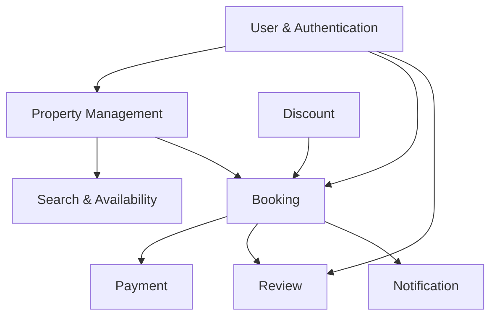
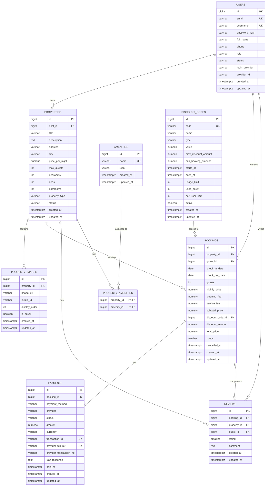
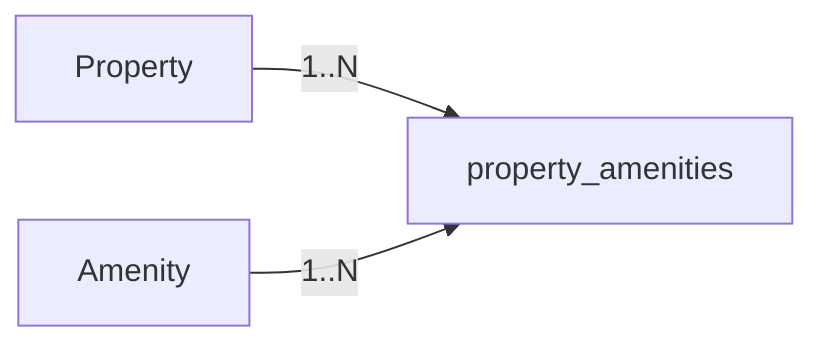
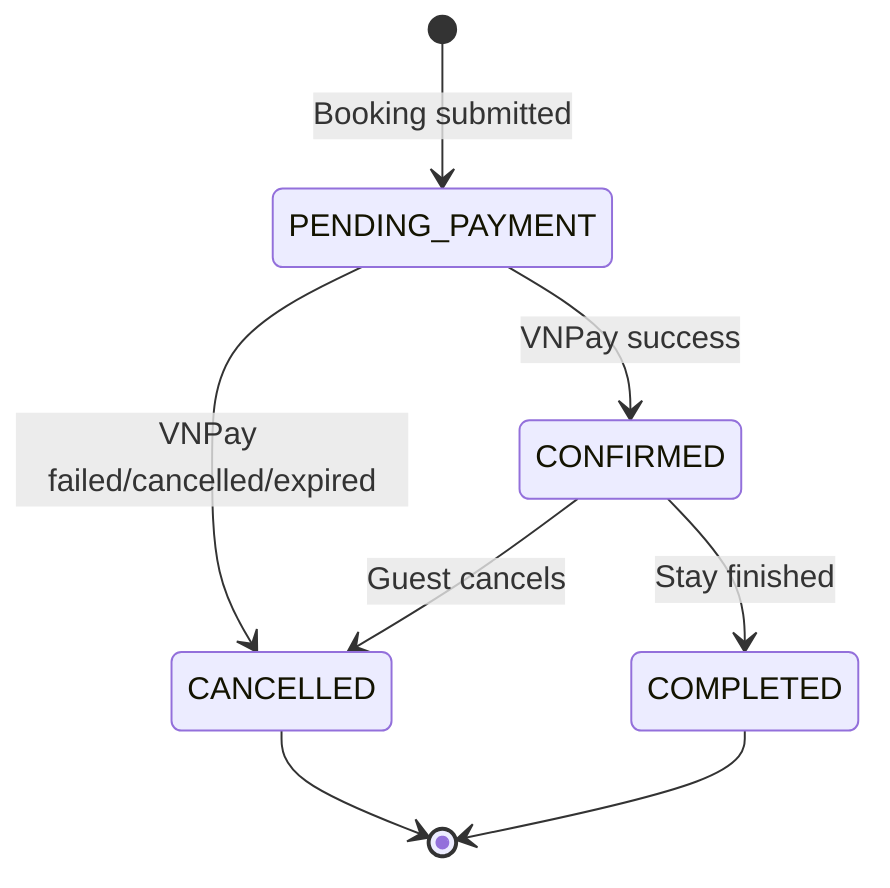
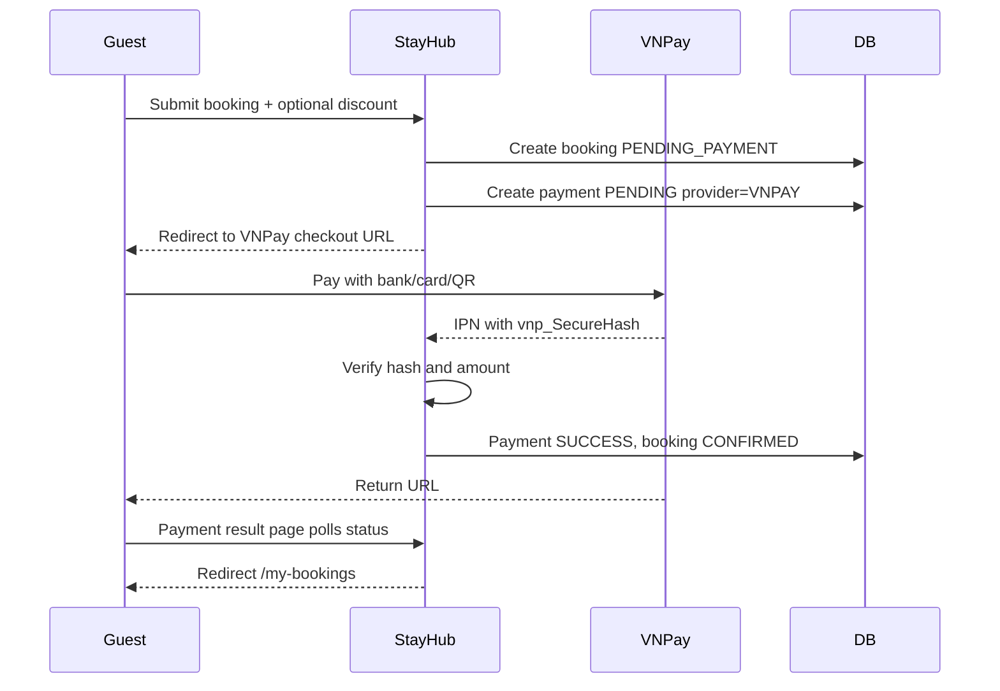
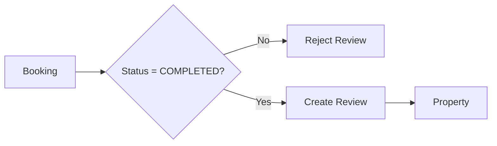
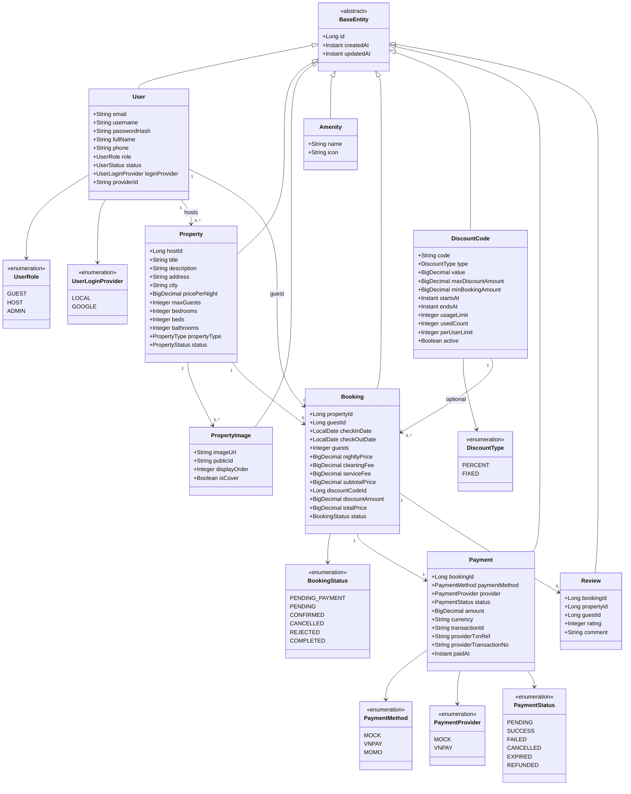
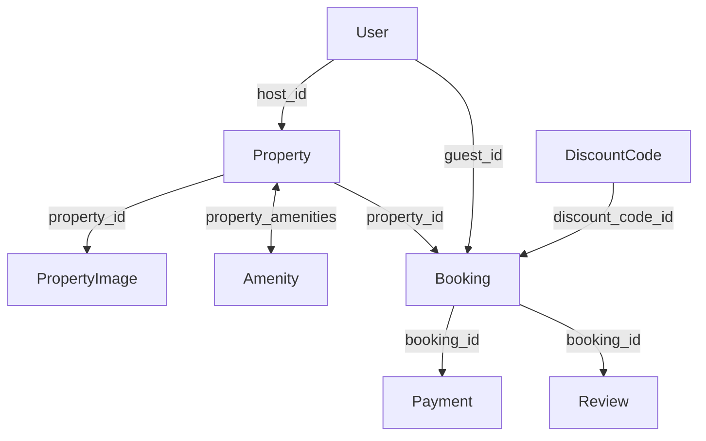
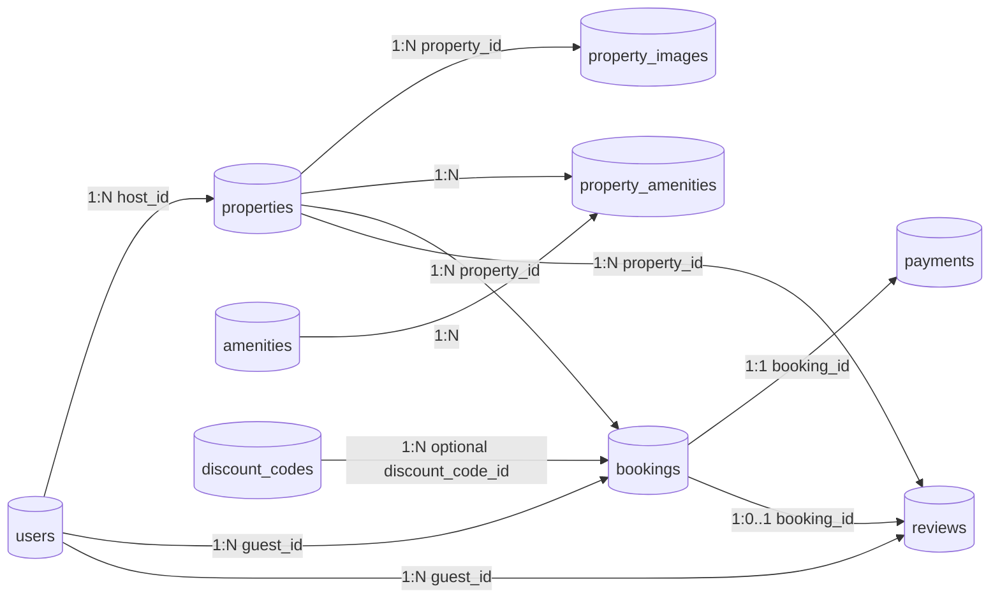
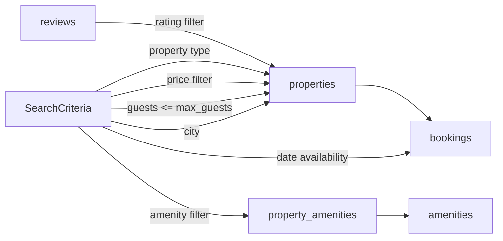

# StayHub MVP — Database Design & Diagrams

> **Purpose:** Database and domain design proposal for the StayHub MVP, based on the project's planned modules: `user`, `property`, `booking`, `payment`, `review`, `host`, `admin`, `storage`, and `notification`.
>
> **Database:** PostgreSQL  
> **Migration:** Flyway  
> **ORM:** Spring Data JPA / Hibernate  
> **Primary key strategy:** `BIGINT` generated IDs for the MVP

---

# 1. Domain Overview

The MVP can be divided into the following main domains:



## Main relationships

- A **User** can act as `GUEST`, `HOST`, or `ADMIN`.
- A **Host** owns multiple **Properties**.
- A **Property** contains multiple **PropertyImages**.
- A **Property** has many **Amenities** through `property_amenities`.
- A **Guest** can create multiple **Bookings**.
- A **Property** can receive multiple **Bookings** over time.
- A **Booking** can optionally apply one **DiscountCode** and stores price/discount snapshots.
- A **Booking** has one payment record in the MVP/VNPay flow.
- A completed **Booking** can have at most one **Review**.

---

# 2. Core ERD



---

# 3. Relational Model

## 3.1 `users`

| Column | Type | Constraint | Description |
|---|---|---|---|
| `id` | BIGINT | PK | User identifier |
| `email` | VARCHAR(255) | NOT NULL, UNIQUE | Login email |
| `username` | VARCHAR(80) | UNIQUE | Username for local accounts |
| `password_hash` | VARCHAR(255) | NOT NULL | BCrypt password hash |
| `full_name` | VARCHAR(150) | NOT NULL | User full name |
| `phone` | VARCHAR(30) | NULL | Contact phone |
| `role` | VARCHAR(20) | NOT NULL | `GUEST`, `HOST`, `ADMIN` |
| `status` | VARCHAR(20) | NOT NULL | `ACTIVE`, `LOCKED`, `INACTIVE` |
| `login_provider` | VARCHAR(20) | NOT NULL | `LOCAL`, `GOOGLE` |
| `provider_id` | VARCHAR(255) | NULL | External OAuth2 provider subject/id |
| `created_at` | TIMESTAMPTZ | NOT NULL | Creation timestamp |
| `updated_at` | TIMESTAMPTZ | NOT NULL | Last update timestamp |

### Recommended constraints

```sql
CONSTRAINT chk_users_role
CHECK (role IN ('GUEST', 'HOST', 'ADMIN'));

CONSTRAINT chk_users_status
CHECK (status IN ('ACTIVE', 'LOCKED', 'INACTIVE'));
```

### Relationship

```text
users
 ├── 1 : N properties
 ├── 1 : N bookings
 └── 1 : N reviews
```

---

## 3.2 `properties`

| Column | Type | Constraint | Description |
|---|---|---|---|
| `id` | BIGINT | PK | Property identifier |
| `host_id` | BIGINT | FK → users.id | Owner/host |
| `title` | VARCHAR(255) | NOT NULL | Property title |
| `description` | TEXT | NOT NULL | Description |
| `address` | VARCHAR(500) | NOT NULL | Address |
| `city` | VARCHAR(100) | NOT NULL | Searchable city |
| `price_per_night` | NUMERIC(12,2) | NOT NULL | Base nightly price |
| `cleaning_fee` | NUMERIC(12,2) | NOT NULL, default 0 | Host-configured cleaning fee |
| `max_guests` | INT | NOT NULL | Maximum guests |
| `bedrooms` | INT | NOT NULL | Bedroom count |
| `beds` | INT | NOT NULL | Bed count |
| `bathrooms` | INT | NOT NULL | Bathroom count |
| `property_type` | VARCHAR(30) | NOT NULL | Property category |
| `status` | VARCHAR(20) | NOT NULL | Listing state |
| `rating_avg` | NUMERIC(3,2) | NOT NULL, default 0 | Cached review average |
| `created_at` | TIMESTAMPTZ | NOT NULL | Creation timestamp |
| `updated_at` | TIMESTAMPTZ | NOT NULL | Last update timestamp |

### Suggested values

```text
property_type:
- APARTMENT
- HOUSE
- VILLA
- HOTEL_ROOM
- HOMESTAY
- RESORT

status:
- ACTIVE
- INACTIVE
- DRAFT
```

### Relationship

```text
users (HOST)
       1
       │
       │ owns
       ▼
properties
  ├── 1 : N property_images
  ├── N : M amenities
  ├── 1 : N bookings
  └── 1 : N reviews
```

---

## 3.3 `property_images`

| Column | Type | Constraint | Description |
|---|---|---|---|
| `id` | BIGINT | PK | Image identifier |
| `property_id` | BIGINT | FK | Related property |
| `image_url` | VARCHAR(1000) | NOT NULL | Image URL |
| `public_id` | VARCHAR(255) | NULL | Cloudinary/local storage identifier |
| `display_order` | INT | NOT NULL | Gallery order |
| `is_cover` | BOOLEAN | NOT NULL | Cover image flag |
| `created_at` | TIMESTAMPTZ | NOT NULL | Creation timestamp |
| `updated_at` | TIMESTAMPTZ | NOT NULL | Last update timestamp |

### Important rule

At most one image should be marked as the cover image for each property.

V4 enforces the invariant with a partial unique index; the service additionally requires a cover before a listing becomes `ACTIVE`:

```text
For each property:
COUNT(property_images WHERE is_cover = true) <= 1
```

Host delete operations archive listings by moving them to `INACTIVE`. They do not physically delete property rows that will be referenced by Booking and Review history.

---

## 3.4 `amenities`

| Column | Type | Constraint | Description |
|---|---|---|---|
| `id` | BIGINT | PK | Amenity identifier |
| `name` | VARCHAR(100) | UNIQUE | Amenity name |
| `icon` | VARCHAR(100) | NULL | Icon identifier |
| `created_at` | TIMESTAMPTZ | NOT NULL | Creation timestamp |
| `updated_at` | TIMESTAMPTZ | NOT NULL | Last update timestamp |

Examples:

```text
WiFi
Air Conditioning
Kitchen
Pool
Parking
Washer
TV
Workspace
```

---

## 3.5 `property_amenities`

This table implements the many-to-many relationship.

| Column | Type | Constraint |
|---|---|---|
| `property_id` | BIGINT | PK, FK → properties.id |
| `amenity_id` | BIGINT | PK, FK → amenities.id |



---

# 4. Booking Data Model

## 4.1 `bookings`

| Column | Type | Constraint | Description |
|---|---|---|---|
| `id` | BIGINT | PK | Booking identifier |
| `property_id` | BIGINT | FK → properties.id | Booked property |
| `guest_id` | BIGINT | FK → users.id | Guest |
| `check_in_date` | DATE | NOT NULL | Check-in |
| `check_out_date` | DATE | NOT NULL | Check-out |
| `guests` | INT | NOT NULL | Guest count |
| `nightly_price` | NUMERIC(12,2) | NOT NULL | Snapshot of nightly price |
| `cleaning_fee` | NUMERIC(12,2) | NOT NULL | Snapshot fee |
| `service_fee` | NUMERIC(12,2) | NOT NULL | Snapshot fee |
| `subtotal_price` | NUMERIC(12,2) | NOT NULL | Price before discount |
| `discount_code_id` | BIGINT | FK → discount_codes.id, NULL | Applied discount code |
| `discount_amount` | NUMERIC(12,2) | NOT NULL | Discount snapshot |
| `total_price` | NUMERIC(12,2) | NOT NULL | Final total after discount |
| `status` | VARCHAR(20) | NOT NULL | Booking status |
| `cancelled_at` | TIMESTAMPTZ | NULL | Cancellation timestamp |
| `created_at` | TIMESTAMPTZ | NOT NULL | Creation timestamp |
| `updated_at` | TIMESTAMPTZ | NOT NULL | Last update timestamp |

## Why store price snapshots?

Do not calculate historical booking totals from the current `properties.price_per_night`.

Example:

```text
January booking:
price_per_night = 1,000,000 VND

March:
Host changes property price to 1,500,000 VND
```

The January booking must still preserve:

```text
nightly_price = 1,000,000
```

Therefore:

```text
properties.price_per_night
        ≠
bookings.nightly_price
```

`bookings` stores the financial snapshot at booking time, including discount snapshots. The backend recalculates price and discount during booking creation; frontend discount previews are not trusted.

---

# 5. Booking State Diagram



## State transition matrix

| Current | Action | Next |
|---|---|---|
| `PENDING_PAYMENT` | VNPay confirms success through verified IPN | `CONFIRMED` |
| `PENDING_PAYMENT` | VNPay failed/cancelled/expired | `CANCELLED` |
| `CONFIRMED` | Guest cancels | `CANCELLED` |
| `CONFIRMED` | Stay completed | `COMPLETED` |

Invalid transitions should raise a business exception.

For example:

```text
COMPLETED → CANCELLED  ❌
CANCELLED → CONFIRMED  ❌
```

---

# 6. Availability / Date Overlap Model

A new booking request conflicts with an existing active booking when:

```text
requested.check_in < existing.check_out
AND
requested.check_out > existing.check_in
```

Equivalent SQL concept:

```sql
WHERE property_id = :propertyId
  AND status IN ('PENDING_PAYMENT', 'CONFIRMED')
  AND check_in_date < :requestedCheckOut
  AND check_out_date > :requestedCheckIn
```

## Visual example

```text
Existing:
|--------- Occupied ---------|
10        11        12        13        14

Request A:
      |----- overlap -----|
      11        12        13

=> NOT AVAILABLE
```

Adjacent bookings should normally be allowed:

```text
Existing:
[ Check-in 10 ] -------- [ Check-out 12 ]

New:
                            [ Check-in 12 ] ----- [ Check-out 15 ]

=> AVAILABLE
```

This is why the overlap condition uses:

```text
new_check_in < existing_check_out
AND
new_check_out > existing_check_in
```

rather than inclusive comparisons.

---

# 7. Payment Model

## `payments`

| Column | Type | Constraint | Description |
|---|---|---|---|
| `id` | BIGINT | PK | Payment identifier |
| `booking_id` | BIGINT | FK, UNIQUE | Related booking |
| `payment_method` | VARCHAR(20) | NOT NULL | `MOCK`, `VNPAY`, `MOMO` |
| `provider` | VARCHAR(20) | NOT NULL | `MOCK`, `VNPAY` |
| `status` | VARCHAR(20) | NOT NULL | Payment state |
| `amount` | NUMERIC(12,2) | NOT NULL | Payment amount |
| `currency` | VARCHAR(3) | NOT NULL | `VND` |
| `transaction_id` | VARCHAR(255) | UNIQUE | Gateway transaction reference |
| `provider_txn_ref` | VARCHAR(100) | UNIQUE | VNPay `vnp_TxnRef` |
| `provider_transaction_no` | VARCHAR(100) | NULL | VNPay `vnp_TransactionNo` |
| `raw_response` | TEXT | NULL | Raw gateway response for audit/debugging |
| `paid_at` | TIMESTAMPTZ | NULL | Success time |
| `created_at` | TIMESTAMPTZ | NOT NULL | Creation timestamp |
| `updated_at` | TIMESTAMPTZ | NOT NULL | Last update timestamp |

## Payment states

```text
PENDING
SUCCESS
FAILED
CANCELLED
EXPIRED
REFUNDED
```

## VNPay relationship



### Recommended business sequence

```text
1. Validate request
2. Check property availability
3. Calculate subtotal and validate discount
4. Create booking with PENDING_PAYMENT
5. Create payment with PENDING and provider_txn_ref
6. Redirect to VNPay checkout URL
7. VNPay calls IPN/webhook
8. Verify secure hash and amount
9. If payment SUCCESS:
      payment = SUCCESS
      booking = CONFIRMED
      increment discount usage if applicable
10. Result page polls status and redirects user to /my-bookings
```

The IPN/webhook is the source of truth. Return URL is only for user experience and must not confirm booking by itself.

---

# 8. Review Data Model

## `reviews`

| Column | Type | Constraint | Description |
|---|---|---|---|
| `id` | BIGINT | PK | Review identifier |
| `booking_id` | BIGINT | FK, UNIQUE | Source booking |
| `property_id` | BIGINT | FK | Reviewed property |
| `guest_id` | BIGINT | FK | Review author |
| `rating` | SMALLINT | NOT NULL | Rating from 1 to 5 |
| `comment` | TEXT | NULL | Review content |
| `created_at` | TIMESTAMPTZ | NOT NULL | Creation timestamp |
| `updated_at` | TIMESTAMPTZ | NOT NULL | Last update timestamp |

### Review rule

```text
Booking.status must equal COMPLETED
```

before a review can be created.



### Recommended constraints

```sql
CONSTRAINT chk_review_rating
CHECK (rating BETWEEN 1 AND 5);
```

`booking_id UNIQUE` ensures:

```text
One booking → at most one review
```

---

# 9. Class Diagram

This is a conceptual JPA/domain class diagram.



---

# 10. Java Entity Relationship Mapping

Suggested mapping:

```text
User
  @OneToMany(mappedBy = "host")
      → properties

Property
  @ManyToOne
      → host

Property
  @OneToMany(mappedBy = "property")
      → images

Property
  @ManyToMany
      → amenities

Booking
  @ManyToOne
      → property

Booking
  @ManyToOne
      → guest

Booking
  @ManyToOne(optional = true)
      → discountCode

Payment
  @OneToOne
      → booking

Review
  @OneToOne
      → booking
```

## Recommended ownership



---

# 11. Repository / Relational Table Summary

| Table | Primary Key | Main Foreign Keys |
|---|---|---|
| `users` | `id` | — |
| `properties` | `id` | `host_id → users.id` |
| `property_images` | `id` | `property_id → properties.id` |
| `amenities` | `id` | — |
| `property_amenities` | `(property_id, amenity_id)` | property + amenity |
| `discount_codes` | `id` | — |
| `bookings` | `id` | `property_id`, `guest_id`, optional `discount_code_id` |
| `payments` | `id` | `booking_id` |
| `reviews` | `id` | `booking_id`, `property_id`, `guest_id` |

---

# 12. Full Relational Diagram



---

# 13. Suggested Indexes

## `users`

```sql
CREATE UNIQUE INDEX uk_users_email
ON users(email);
```

## `properties`

```sql
CREATE INDEX idx_properties_host_id
ON properties(host_id);

CREATE INDEX idx_properties_city
ON properties(city);

CREATE INDEX idx_properties_price
ON properties(price_per_night);

CREATE INDEX idx_properties_status
ON properties(status);
```

## `bookings`

Availability checking will be a frequent query.

```sql
CREATE INDEX idx_bookings_property_dates
ON bookings(property_id, check_in_date, check_out_date);

CREATE INDEX idx_bookings_guest_id
ON bookings(guest_id);

CREATE INDEX idx_bookings_status
ON bookings(status);
```

## `discount_codes`

```sql
CREATE UNIQUE INDEX uk_discount_codes_code
ON discount_codes(code);

CREATE INDEX idx_discount_codes_active_window
ON discount_codes(active, starts_at, ends_at);
```

## `payments`

```sql
CREATE UNIQUE INDEX uk_payments_provider_txn_ref
ON payments(provider, provider_txn_ref);
```

## `property_images`

```sql
CREATE INDEX idx_property_images_property_id
ON property_images(property_id);
```

## `reviews`

```sql
CREATE INDEX idx_reviews_property_id
ON reviews(property_id);
```

---

# 14. Search Data Relationships

Search uses property data plus booking data.



### Example search criteria

```text
location = "Da Nang"
checkIn = 2026-09-10
checkOut = 2026-09-13
guests = 2

filters:
- minPrice
- maxPrice
- propertyType
- bedrooms
- amenities
- rating
```

Search should return properties where:

```text
city matches
AND max_guests >= requestedGuests
AND price matches filters
AND no conflicting active booking exists
```

---

# 15. Database Migration Plan

Canonical Flyway migration sequence:

```text
V1__create_users.sql
V2__normalize_user_emails.sql
V3__create_properties.sql
V4__create_property_images.sql
V5__create_amenities.sql
V6__create_property_amenities.sql
V7__create_bookings.sql
V8__create_payments.sql
V9__create_reviews.sql
V10__add_usernames.sql
V11__add_user_login_provider.sql
V12__create_discount_codes.sql
V13__add_booking_discount_and_pending_payment.sql
V14__add_vnpay_payment_fields.sql
```

## Recommended rule

Do not edit an already-applied migration.

Instead:

```text
Wrong:
V3__create_properties.sql
  → modify after other developers have run it
```

Use:

```text
Correct:
V11__add_property_status.sql
```

---

# 16. BaseEntity Design

All main entities can inherit common audit fields.

```java
@MappedSuperclass
public abstract class BaseEntity {

    @Id
    @GeneratedValue(strategy = GenerationType.IDENTITY)
    private Long id;

    @Column(name = "created_at", nullable = false, updatable = false)
    private Instant createdAt;

    @Column(name = "updated_at", nullable = false)
    private Instant updatedAt;
}
```

Inheritance:

```text
BaseEntity
    │
    ├── User
    ├── Property
    ├── PropertyImage
    ├── Amenity
    ├── Booking
    ├── Payment
    └── Review
```

---

# 17. Important Business Rules

## User

```text
email must be unique
username should be unique for local accounts
role ∈ GUEST, HOST, ADMIN
login_provider ∈ LOCAL, GOOGLE
```

## Property

```text
price_per_night > 0
max_guests > 0
bedrooms >= 0
beds >= 0
bathrooms >= 0
```

## Booking

```text
check_in_date < check_out_date
guests > 0
guests <= property.max_guests
no date overlap with active bookings
PENDING_PAYMENT and CONFIRMED block availability
subtotal_price - discount_amount = total_price
```

## Discount

```text
code must be unique
type ∈ PERCENT, FIXED
value > 0
used_count increments only after verified payment SUCCESS
frontend preview must be revalidated when creating booking/payment
```

## Payment

```text
amount >= 0
one payment record per MVP booking
VNPay IPN/webhook is the source of truth
verify secure hash and amount before marking payment SUCCESS
booking CONFIRMED only after verified payment SUCCESS
```

## Review

```text
1 <= rating <= 5
booking must belong to the reviewing guest
booking.status = COMPLETED
one booking can create at most one review
```

---

# 18. Recommended Package ↔ Table Mapping

```text
com.stayhub.user
    └── users

com.stayhub.property
    ├── properties
    ├── property_images
    ├── amenities
    └── property_amenities

com.stayhub.booking
    └── bookings

com.stayhub.discount
    └── discount_codes

com.stayhub.payment
    └── payments

com.stayhub.review
    └── reviews
```

This keeps the Java code feature-based while maintaining a clear mapping to relational tables.

---

# 19. Future Extensions

These should not necessarily be included in the first MVP schema.

## Wishlist

```text
wishlists
- id
- user_id
- property_id
- created_at
```

Relationship:

```text
User N : M Property
```

## Notification

```text
notifications
- id
- user_id
- type
- title
- content
- is_read
- created_at
```

## Payment extensions

Possible additions:

```text
payment_attempts
payment_webhook_events
refunds
```

## Availability optimization

If the application grows significantly, consider:

```text
property_availability
```

or PostgreSQL range/exclusion constraints to strengthen date-overlap guarantees.

---

# 20. Final MVP Database Summary

```text
                    ┌───────────────┐
                    │     USERS     │
                    └───────┬───────┘
                       HOST │ GUEST
                            │
          ┌─────────────────┴─────────────────┐
          ▼                                   ▼
   ┌───────────────┐                   ┌───────────────┐
   │  PROPERTIES   │◄──────────────────│   BOOKINGS    │
   └───────┬───────┘                   └───┬─────┬─────┘
           │                               │     │
     ┌─────┼─────────┐                     │     ▼
     ▼     ▼         ▼                     │  PAYMENTS
  IMAGES AMENITIES BOOKINGS                │
           │                               ▼
           ▼                         DISCOUNT_CODES
  PROPERTY_AMENITIES                       │
                                           ▼
                                        REVIEWS
```

## MVP tables

```text
1. users
2. properties
3. property_images
4. amenities
5. property_amenities
6. bookings
7. payments
8. reviews
9. discount_codes
```

This design supports the complete MVP flow:

```text
Register/Login
    ↓
Search Property
    ↓
Property Detail
    ↓
Check Availability
    ↓
Apply Discount optional
    ↓
Create Booking PENDING_PAYMENT
    ↓
Create VNPay Payment PENDING
    ↓
VNPay Checkout
    ↓
Verified IPN Payment Success
    ↓
Booking CONFIRMED
    ↓
COMPLETED
    ↓
Review
```
