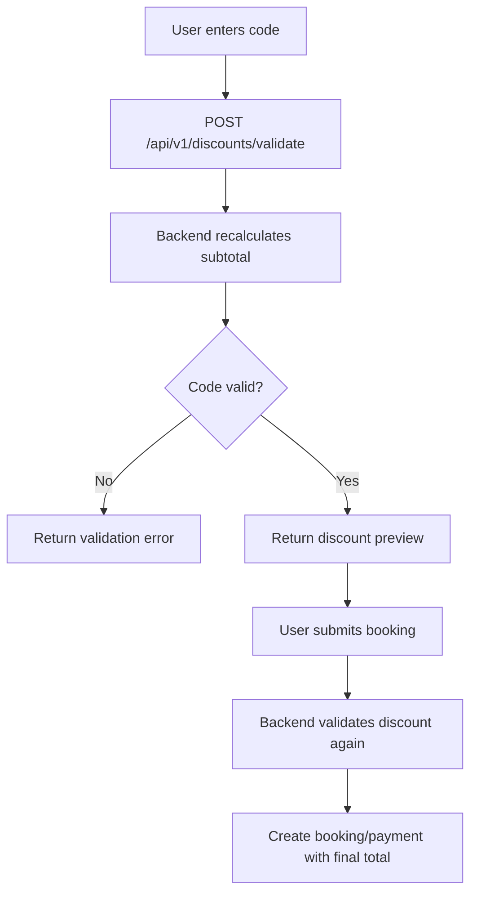

# Discounts

Discounts are applied during booking price calculation and must be revalidated on the backend when creating a payment. The frontend discount preview is only a convenience for the user.

| Column | Type | Constraint | Description |
|---|---|---|---|
| `id` | BIGINT | PK | Discount identifier |
| `code` | VARCHAR(50) | NOT NULL, UNIQUE | Public promo code, stored uppercase |
| `name` | VARCHAR(150) | NOT NULL | Display/internal name |
| `type` | VARCHAR(20) | NOT NULL | `PERCENT`, `FIXED` |
| `value` | NUMERIC(12,2) | NOT NULL | Percentage or fixed amount depending on type |
| `max_discount_amount` | NUMERIC(12,2) | NULL | Cap for percent discounts |
| `min_booking_amount` | NUMERIC(12,2) | NULL | Minimum subtotal required |
| `starts_at` | TIMESTAMPTZ | NULL | Valid from |
| `ends_at` | TIMESTAMPTZ | NULL | Valid until |
| `usage_limit` | INT | NULL | Global usage limit |
| `used_count` | INT | NOT NULL | Successful paid usages |
| `per_user_limit` | INT | NULL | Optional per-user cap |
| `active` | BOOLEAN | NOT NULL | Whether code can be used |
| `created_at` | TIMESTAMPTZ | NOT NULL | Creation timestamp |
| `updated_at` | TIMESTAMPTZ | NOT NULL | Last update timestamp |

## Recommended constraints

```sql
CONSTRAINT chk_discount_type
CHECK (type IN ('PERCENT', 'FIXED'));

CONSTRAINT chk_discount_value_positive
CHECK (value > 0);

CONSTRAINT chk_discount_used_count
CHECK (used_count >= 0);
```

## Calculation rules

```text
subtotal_price = nightly_price * nights + cleaning_fee + service_fee

PERCENT:
discount_amount = subtotal_price * value / 100
discount_amount = min(discount_amount, max_discount_amount) when cap exists

FIXED:
discount_amount = min(value, subtotal_price)

total_price = subtotal_price - discount_amount
```

## Usage rules

- A code is valid only when `active = true` and current time is between `starts_at` and `ends_at` if they are set.
- `subtotal_price` must satisfy `min_booking_amount` if present.
- `used_count` is incremented only after payment becomes `SUCCESS` through a verified payment callback.
- If payment fails/cancels/expires, do not increment `used_count`.
- Backend must revalidate the code when creating booking/payment; never trust discount amount from frontend.

## Discount validation flow


