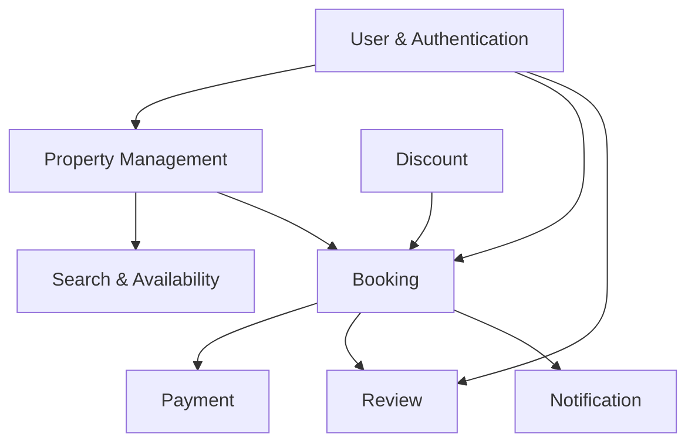

## Main relationships

- A **User** can act as `GUEST`, `HOST`, or `ADMIN`.
- A **Host** owns multiple **Properties**.
- A **Property** contains multiple **PropertyImages**.
- A **Property** has many **Amenities** through `property_amenities`.
- A **Guest** can create multiple **Bookings**.
- A **Property** can receive multiple **Bookings** over time.
- A **Booking** can optionally apply one **DiscountCode** and stores discount snapshots.
- A **Booking** has one payment record in the MVP/VNPay flow.
- A completed **Booking** can have at most one **Review**.
