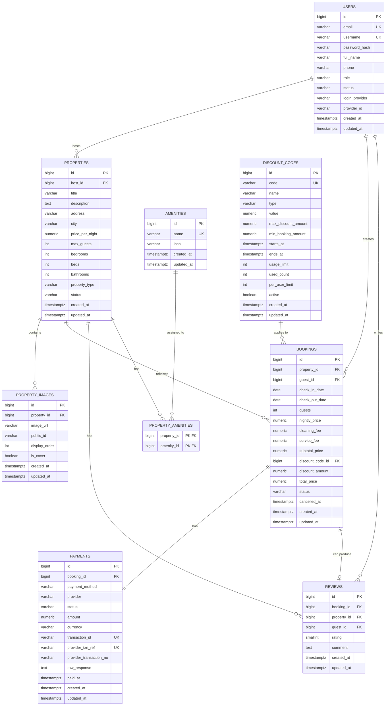

```mermaid
erDiagram

    USERS {
        bigint id PK
        varchar email UK
        varchar username UK
        varchar password_hash
        varchar full_name
        varchar phone
        varchar role
        varchar status
        varchar login_provider
        varchar provider_id
        timestamptz created_at
        timestamptz updated_at
    }

    PROPERTIES {
        bigint id PK
        bigint host_id FK
        varchar title
        text description
        varchar address
        varchar city
        numeric price_per_night
        int max_guests
        int bedrooms
        int beds
        int bathrooms
        varchar property_type
        varchar status
        timestamptz created_at
        timestamptz updated_at
    }

    PROPERTY_IMAGES {
        bigint id PK
        bigint property_id FK
        varchar image_url
        varchar public_id
        int display_order
        boolean is_cover
        timestamptz created_at
        timestamptz updated_at
    }

    AMENITIES {
        bigint id PK
        varchar name UK
        varchar icon
        timestamptz created_at
        timestamptz updated_at
    }

    PROPERTY_AMENITIES {
        bigint property_id PK, FK
        bigint amenity_id PK, FK
    }

    BOOKINGS {
        bigint id PK
        bigint property_id FK
        bigint guest_id FK
        date check_in_date
        date check_out_date
        int guests
        numeric nightly_price
        numeric cleaning_fee
        numeric service_fee
        numeric subtotal_price
        bigint discount_code_id FK
        numeric discount_amount
        numeric total_price
        varchar status
        timestamptz cancelled_at
        timestamptz created_at
        timestamptz updated_at
    }

    DISCOUNT_CODES {
        bigint id PK
        varchar code UK
        varchar name
        varchar type
        numeric value
        numeric max_discount_amount
        numeric min_booking_amount
        timestamptz starts_at
        timestamptz ends_at
        int usage_limit
        int used_count
        int per_user_limit
        boolean active
        timestamptz created_at
        timestamptz updated_at
    }

    PAYMENTS {
        bigint id PK
        bigint booking_id FK
        varchar payment_method
        varchar provider
        varchar status
        numeric amount
        varchar currency
        varchar transaction_id UK
        varchar provider_txn_ref UK
        varchar provider_transaction_no
        text raw_response
        timestamptz paid_at
        timestamptz created_at
        timestamptz updated_at
    }

    REVIEWS {
        bigint id PK
        bigint booking_id FK
        bigint property_id FK
        bigint guest_id FK
        smallint rating
        text comment
        timestamptz created_at
        timestamptz updated_at
    }

    USERS ||--o{ PROPERTIES : "hosts"
    USERS ||--o{ BOOKINGS : "creates"
    USERS ||--o{ REVIEWS : "writes"

    PROPERTIES ||--o{ PROPERTY_IMAGES : "contains"
    PROPERTIES ||--o{ BOOKINGS : "receives"
    PROPERTIES ||--o{ REVIEWS : "has"

    PROPERTIES ||--o{ PROPERTY_AMENITIES : "has"
    AMENITIES ||--o{ PROPERTY_AMENITIES : "assigned to"

    DISCOUNT_CODES ||--o{ BOOKINGS : "applies to"
    BOOKINGS ||--|| PAYMENTS : "has"
    BOOKINGS ||--o| REVIEWS : "can produce"
```
