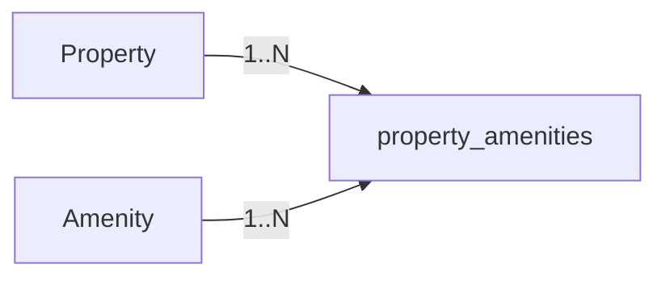

# Properties

| Column | Type | Constraint | Description |
|---|---|---|---|
| `id` | BIGINT | PK | Property identifier |
| `host_id` | BIGINT | FK → users.id | Owner/host |
| `title` | VARCHAR(255) | NOT NULL | Property title |
| `description` | TEXT | NOT NULL | Description |
| `address` | VARCHAR(500) | NOT NULL | Address |
| `city` | VARCHAR(100) | NOT NULL | Searchable city |
| `price_per_night` | NUMERIC(12,2) | NOT NULL | Base nightly price |
| `cleaning_fee` | NUMERIC(12,2) | NOT NULL, default 0 | Host-configured cleaning fee |
| `max_guests` | INT | NOT NULL | Maximum guests |
| `bedrooms` | INT | NOT NULL | Bedroom count |
| `beds` | INT | NOT NULL | Bed count |
| `bathrooms` | INT | NOT NULL | Bathroom count |
| `property_type` | VARCHAR(30) | NOT NULL | Property category |
| `status` | VARCHAR(20) | NOT NULL | Listing state |
| `rating_avg` | NUMERIC(3,2) | NOT NULL, default 0 | Cached review average used by search/detail |
| `created_at` | TIMESTAMPTZ | NOT NULL | Creation timestamp |
| `updated_at` | TIMESTAMPTZ | NOT NULL | Last update timestamp |

### Suggested values

```text
property_type:
- APARTMENT
- HOUSE
- VILLA
- HOTEL_ROOM
- HOMESTAY
- RESORT

status:
- ACTIVE
- INACTIVE
- DRAFT
```

### Relationship

```text
users (HOST)
       1
       │
       │ owns
       ▼
properties
  ├── 1 : N property_images
  ├── N : M amenities
  ├── 1 : N bookings
  └── 1 : N reviews
```

# Property_Images

| Column | Type | Constraint | Description |
|---|---|---|---|
| `id` | BIGINT | PK | Image identifier |
| `property_id` | BIGINT | FK | Related property |
| `image_url` | VARCHAR(1000) | NOT NULL | Image URL |
| `public_id` | VARCHAR(255) | NULL | Cloudinary/local storage identifier |
| `display_order` | INT | NOT NULL | Gallery order |
| `is_cover` | BOOLEAN | NOT NULL | Cover image flag |
| `created_at` | TIMESTAMPTZ | NOT NULL | Creation timestamp |
| `updated_at` | TIMESTAMPTZ | NOT NULL | Last update timestamp |

### Important rule

At most one image should be marked as the cover image for each property. V4 enforces this with a PostgreSQL partial unique index. `display_order` is unique inside each property.

Possible application-level invariant:

```text
For each property:
COUNT(property_images WHERE is_cover = true) <= 1
```

An `ACTIVE` property must have a cover image. If the final image is removed, the service returns the property to `DRAFT`. Host delete actions archive a property as `INACTIVE`; they do not physically delete rows needed by future Booking/Review history.


# Property_Amenities

This table implements the many-to-many relationship.

| Column | Type | Constraint |
|---|---|---|
| `property_id` | BIGINT | PK, FK → properties.id |
| `amenity_id` | BIGINT | PK, FK → amenities.id |


