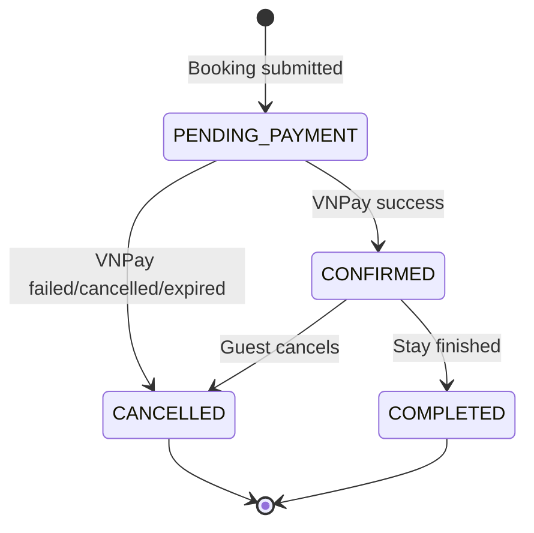

# Bookings

| Column | Type | Constraint | Description |
|---|---|---|---|
| `id` | BIGINT | PK | Booking identifier |
| `property_id` | BIGINT | FK → properties.id | Booked property |
| `guest_id` | BIGINT | FK → users.id | Guest |
| `check_in_date` | DATE | NOT NULL | Check-in |
| `check_out_date` | DATE | NOT NULL | Check-out |
| `guests` | INT | NOT NULL | Guest count |
| `nightly_price` | NUMERIC(12,2) | NOT NULL | Snapshot of nightly price |
| `cleaning_fee` | NUMERIC(12,2) | NOT NULL | Snapshot fee |
| `service_fee` | NUMERIC(12,2) | NOT NULL | Snapshot fee |
| `subtotal_price` | NUMERIC(12,2) | NOT NULL | Price before discount |
| `discount_code_id` | BIGINT | FK → discount_codes.id, NULL | Applied discount code |
| `discount_amount` | NUMERIC(12,2) | NOT NULL | Discount snapshot |
| `total_price` | NUMERIC(12,2) | NOT NULL | Final total after discount |
| `status` | VARCHAR(20) | NOT NULL | Booking status |
| `cancelled_at` | TIMESTAMPTZ | NULL | Cancellation timestamp |
| `created_at` | TIMESTAMPTZ | NOT NULL | Creation timestamp |
| `updated_at` | TIMESTAMPTZ | NOT NULL | Last update timestamp |

## Why store price snapshots?

Do not calculate historical booking totals from the current `properties.price_per_night`.

Example:

```text
January booking:
price_per_night = 1,000,000 VND

March:
Host changes property price to 1,500,000 VND
```

The January booking must still preserve:

```text
nightly_price = 1,000,000
```

Therefore:

```text
properties.price_per_night
        ≠
bookings.nightly_price
```

`bookings` stores the financial snapshot at booking time, including discount information. Discount preview on the frontend is not trusted; the backend recalculates `subtotal_price`, `discount_amount`, and `total_price` when creating the booking/payment.




If the project later restores Host approval after payment, insert `PENDING_HOST_CONFIRMATION` between `PENDING_PAYMENT` and `CONFIRMED`.

## State transition matrix

| Current | Action | Next |
|---|---|---|
| `PENDING_PAYMENT` | VNPay confirms success through verified IPN | `CONFIRMED` |
| `PENDING_PAYMENT` | VNPay returns failed/cancelled/expired | `CANCELLED` |
| `CONFIRMED` | Guest cancels | `CANCELLED` |
| `CONFIRMED` | Stay completed | `COMPLETED` |

Invalid transitions should raise a business exception.

For example:

```text
COMPLETED → CANCELLED  ❌
CANCELLED → CONFIRMED  ❌
```
