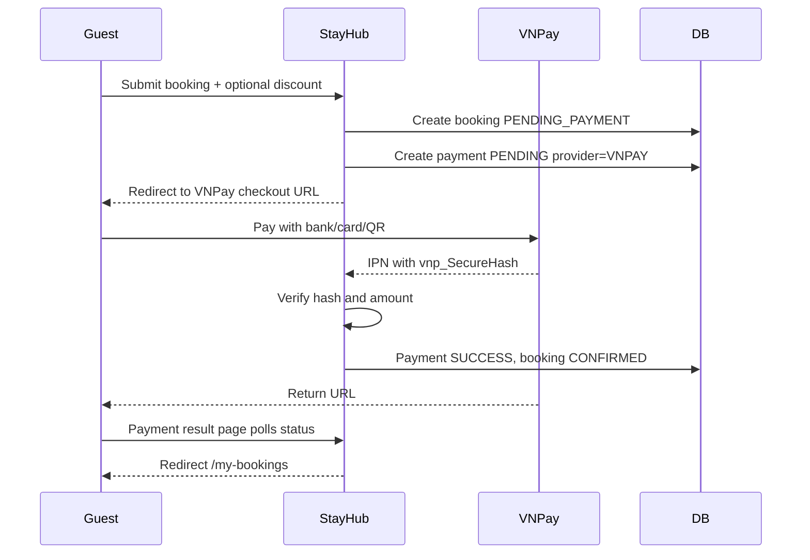

# Payment


| Column | Type | Constraint | Description |
|---|---|---|---|
| `id` | BIGINT | PK | Payment identifier |
| `booking_id` | BIGINT | FK, UNIQUE | Related booking |
| `payment_method` | VARCHAR(20) | NOT NULL | `MOCK`, `VNPAY`, `MOMO` |
| `provider` | VARCHAR(20) | NOT NULL | Payment provider, initially `MOCK` or `VNPAY` |
| `status` | VARCHAR(20) | NOT NULL | Payment state |
| `amount` | NUMERIC(12,2) | NOT NULL | Payment amount |
| `currency` | VARCHAR(3) | NOT NULL | `VND` |
| `transaction_id` | VARCHAR(255) | UNIQUE | Legacy/internal transaction reference |
| `provider_txn_ref` | VARCHAR(100) | UNIQUE | VNPay `vnp_TxnRef` |
| `provider_transaction_no` | VARCHAR(100) | NULL | VNPay `vnp_TransactionNo` |
| `raw_response` | TEXT | NULL | Raw gateway response for audit/debugging |
| `paid_at` | TIMESTAMPTZ | NULL | Success time |
| `created_at` | TIMESTAMPTZ | NOT NULL | Creation timestamp |
| `updated_at` | TIMESTAMPTZ | NOT NULL | Last update timestamp |

## Payment states

```text
PENDING
SUCCESS
FAILED
CANCELLED
EXPIRED
REFUNDED
```

## VNPay relationship



### Recommended business sequence

```text
1. Validate request
2. Check property availability
3. Calculate subtotal
4. Validate discount again on backend
5. Create booking with PENDING_PAYMENT
6. Create payment with PENDING and provider_txn_ref
7. Redirect to VNPay checkout URL
8. VNPay calls IPN/webhook
9. Verify secure hash and amount
10. If payment SUCCESS:
      payment = SUCCESS
      booking = CONFIRMED
      increment discount usage if applicable
11. Result page polls status and redirects user to /my-bookings
```

## VNPay verification rules

- Treat IPN/webhook as the source of truth; return URL is for user experience only.
- Always verify `vnp_SecureHash` using `VNPAY_HASH_SECRET`.
- Always compare `vnp_Amount / 100` against `payments.amount`.
- Updates must be idempotent because VNPay can retry IPN.
- Never log `VNPAY_HASH_SECRET`.
- Do not mark booking confirmed from frontend-only success URL.
