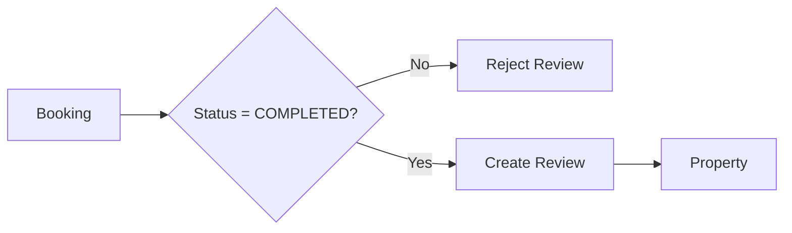

# Reviews


| Column | Type | Constraint | Description |
|---|---|---|---|
| `id` | BIGINT | PK | Review identifier |
| `booking_id` | BIGINT | FK, UNIQUE | Source booking |
| `property_id` | BIGINT | FK | Reviewed property |
| `guest_id` | BIGINT | FK | Review author |
| `rating` | SMALLINT | NOT NULL | Rating from 1 to 5 |
| `comment` | TEXT | NULL | Review content |
| `created_at` | TIMESTAMPTZ | NOT NULL | Creation timestamp |
| `updated_at` | TIMESTAMPTZ | NOT NULL | Last update timestamp |

### Review rule

```text
Booking.status must equal COMPLETED
```

before a review can be created.



### Recommended constraints

```sql
CONSTRAINT chk_review_rating
CHECK (rating BETWEEN 1 AND 5);
```

`booking_id UNIQUE` ensures:

```text
One booking → at most one review
```
