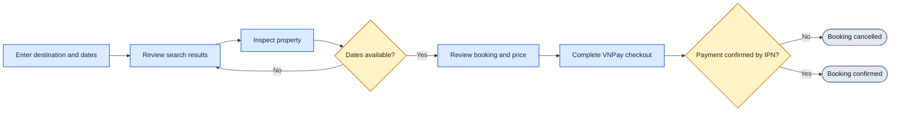
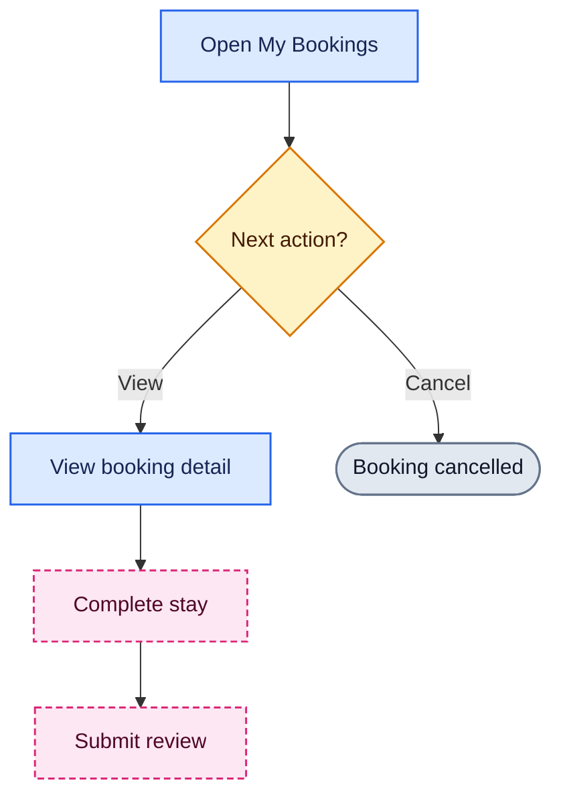

# User Journeys

## Discovery To Checkout

**Câu hỏi:** Hành trình chính mà Guest muốn hoàn thành là gì?

**Trạng thái:** Thiết kế mục tiêu. UI hiện dùng mock data và chưa nối tới booking
backend; xem [Current UI integration](../architecture/runtime-architecture.md#current-ui-integration).

## Post-booking Journey

**Câu hỏi:** Guest làm gì sau khi booking đã được tạo?

Nét đứt biểu thị phần chưa khả dụng end-to-end: UI booking hiện là mock và chưa
có trigger chuyển booking sang `COMPLETED`.
